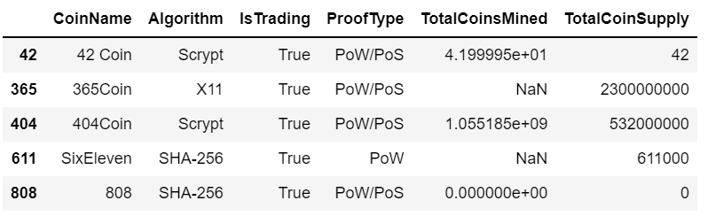
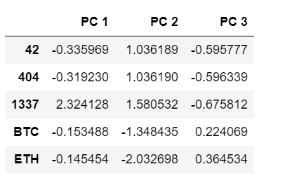
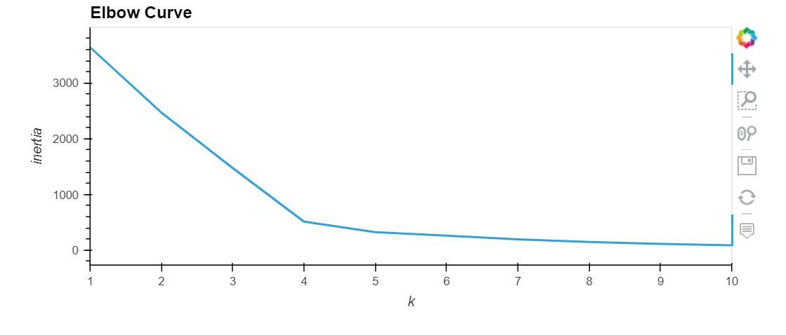
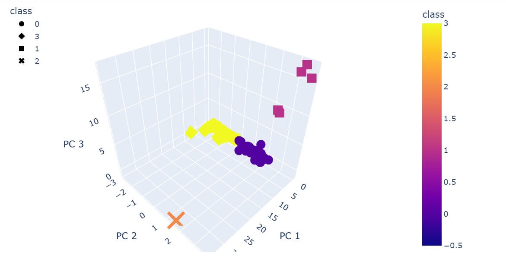
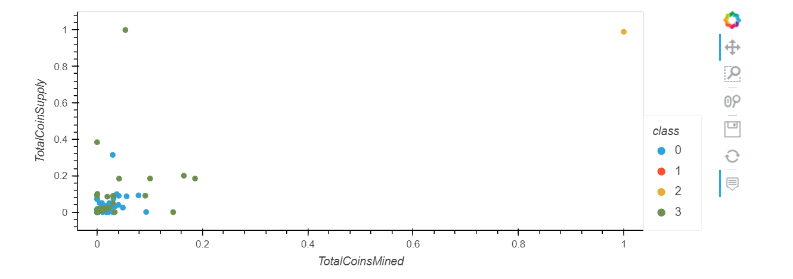

# Cryptocurrencies Analysis

## **Overview of the analysis**: 

### The purpose of this analysis was to create a report that included what cryptocurrencies are on the trading market and how they could be grouped to create a classification system for this new investment.

#### We first processed the data to fit the unsupervised machine learning models. To group the cryptocurrencies, we used a clustering algorithm. Finally, we used data visualizations to share our findings with the board.

## **Summary of the Analysis**:

### * Deliverable 1: Preprocessing the Data for PCA

### * Deliverable 2: Reducing Data Dimensions Using PCA

### * Deliverable 3: Clustering Cryptocurrencies Using K-means

### * Deliverable 4: Visualizing Cryptocurrencies Results

